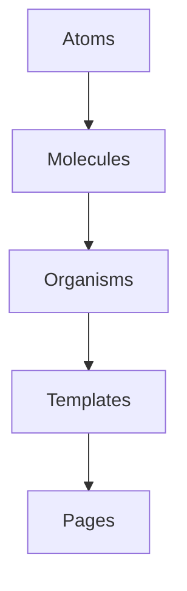
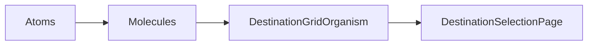
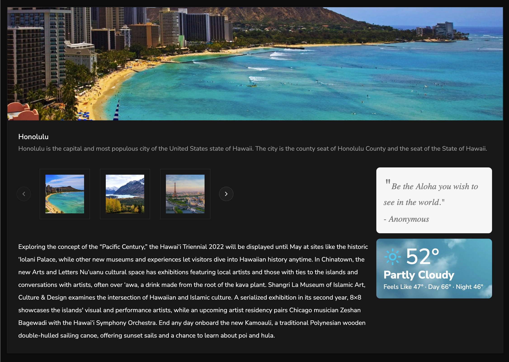
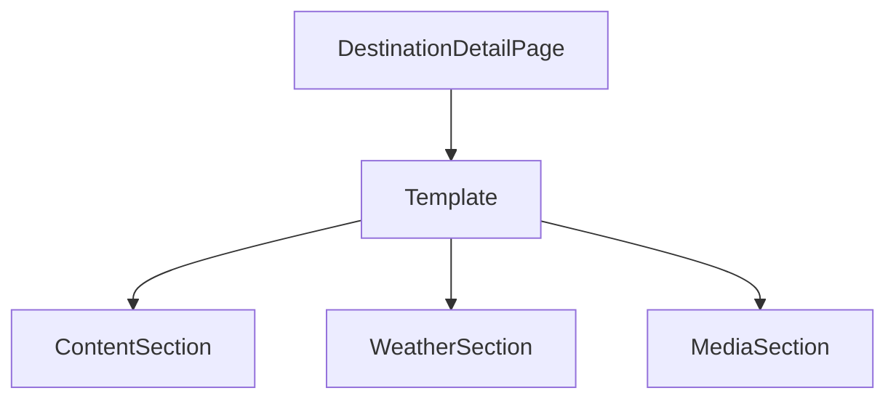
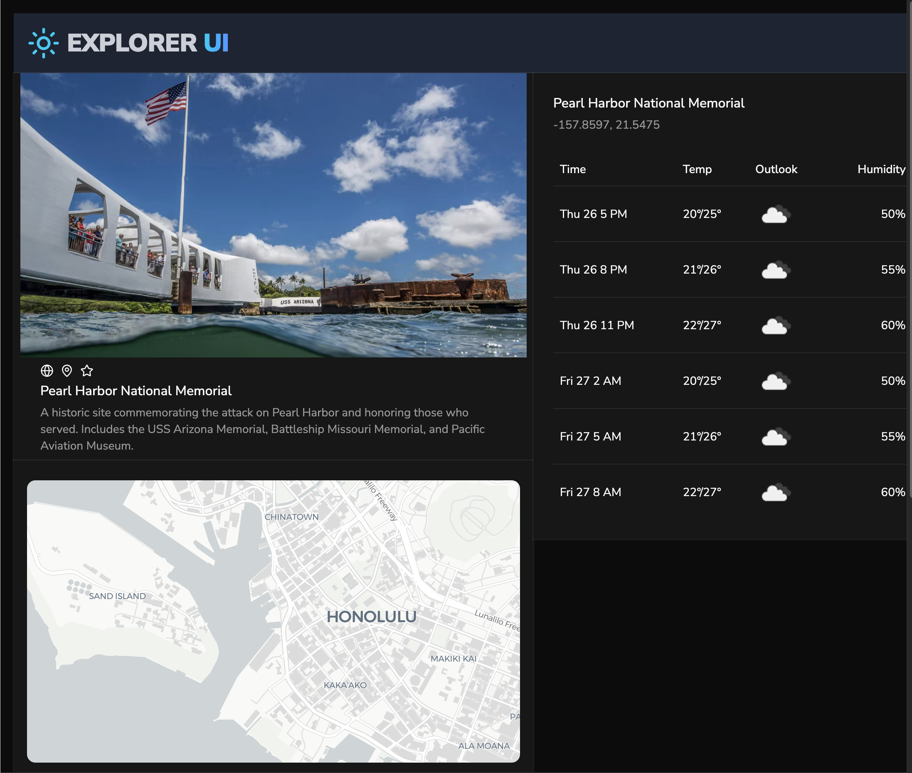
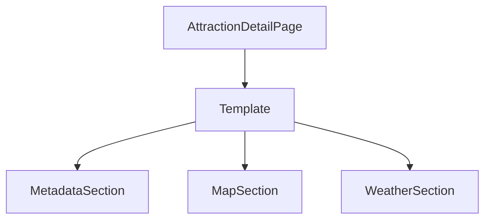
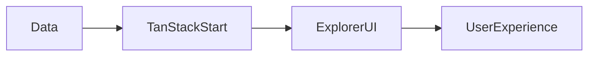

# 🌍 Explorer UI

### Designing Intelligent Travel Experiences

Explorer UI is a composable UI system built for modern travel applications that blend **AI storytelling, real-time data, and beautiful interface design**.

Built with:

- **Shadcn UI**
- **Atomic Design methodology**
- **Storybook for live component documentation**
- **TanStack Start**
- **TypeScript + Tailwind CSS**

Explorer UI isn’t just a component library — it’s a design foundation for generative travel experiences.

---


---

# ✨ The Experience We’re Building

Travel is emotional.  
It’s inspirational.  
It’s informational.

Explorer UI enables experiences where:

- Users discover destinations visually
- AI generates personalized travel narratives
- Weather data adds real-world context
- Attractions are presented with clarity and structure
- Every screen feels cohesive and intentional

The goal is simple:

> Let AI generate the story.  
> Let design deliver the experience.

---

# 🧩 A System, Not Just Components

Explorer UI follows **Atomic Design** to ensure consistency and scalability.



````

This allows us to:

- Maintain visual consistency
- Reuse patterns across features
- Design once, compose everywhere
- Scale without redesigning

Every page in the app is composed from predictable building blocks.

---

# 🚀 Core Product Use Cases

## 1️⃣ Destination Selection

Users begin their journey by choosing a destination.

### Experience Goals

- Visually compelling
- Easy to scan
- Responsive across devices
- Adaptable to curated or AI-generated results

### System Composition

- Atoms for typography, imagery, and interactive controls
- Molecules for structured card layouts
- Organisms for grid presentation
- Templates for responsive page structure



### Why It Matters

This pattern supports:

- AI recommendations
- Editorial curation
- Seasonal content
- Personalization

Without changing the layout system.

---

## 2️⃣ Destination Detail View



When a user selects a destination, they experience:

- A customized AI-generated article
- Destination imagery
- Current weather forecast

### Experience Goals

- Story-first layout
- Strong visual hierarchy
- Clear contextual data (weather)
- Space for personalization

### System Composition

- Structured content containers
- Modular weather presentation
- Media sections
- Reusable layout template



### Design Advantage

The layout remains stable while content changes dynamically.

This creates:

- Trust in structure
- Flexibility in storytelling
- Room for experimentation

AI enhances the content —
the UI preserves the experience.

---

## 3️⃣ Attraction Detail View



When users explore a specific attraction, they see:

- Description
- Activities
- Hours of operation
- Contact information
- Location map
- Weather forecast

### Experience Goals

- Clear information hierarchy
- Actionable details
- Geographical context
- No clutter

### System Composition

- Structured metadata blocks
- Reusable information patterns
- Map container
- Weather module reused from destination view



### Product Strength

Because patterns are reusable:

- Weather appears consistently across features
- Metadata layouts stay uniform
- New data types can be added easily

The system grows without visual fragmentation.

---

# 📘 Storybook: Where Design and Code Meet

Storybook acts as a shared design language between:

- Designers
- Engineers
- Product stakeholders

It provides:

- Live component previews
- State exploration
- Accessibility review
- Prop-level experimentation

```bash
pnpm install
pnpm run storybook
```

Storybook transforms the UI library into a living design system.

---

# 🔷 Built on TanStack Start

Explorer UI runs within TanStack Start, giving us:

- Modern routing
- Predictable data loading
- Type-safe development
- Flexible rendering strategies



This foundation supports:

- Real-time weather
- AI-generated content hydration
- Future expansion into booking and itinerary tools

---

# 🎯 Why Explorer UI Matters

Explorer UI enables a rare balance:

- Structured design system
- Generative content flexibility
- Scalable architecture
- Creative storytelling

It supports both:

- The emotional side of travel discovery
- The informational side of travel planning

And it does so in a cohesive, extensible way.

---

# 🛠 Getting Started

```bash
pnpm install
pnpm dev
pnpm run storybook
```

---

# 🔮 What’s Next

- Itinerary composition experiences
- Trip timeline patterns
- Theming expansion
- Enhanced generative layout experimentation

Explorer UI is not just about building screens.

It’s about designing how travelers experience intelligent assistance.
````
